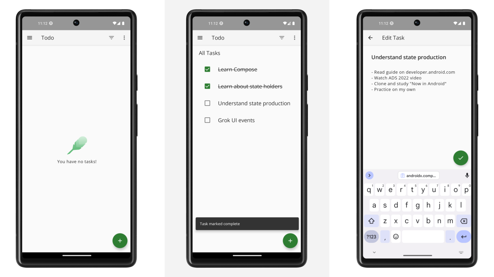

# Android Architecture Template Starter

A robust and scalable Android project template designed to kickstart your app development with best practices and modern architecture components.

## Table of Contents

- [Features](#features)
- [Screenshots](#screenshots)
- [Why This Template?](#why-this-template)
- [Who Is It For?](#who-is-it-for)
- [Getting Started](#getting-started)
  - [Prerequisites](#prerequisites)
  - [Installation](#installation)
- [Project Structure](#project-structure)
- [Testing](#testing)
- [Contributing](#contributing)
- [License](#license)

## Features

This template incorporates a comprehensive set of modern Android development tools and architectural patterns to ensure your project is maintainable, testable, and scalable.

General:
- **Jetpack Compose**: Build expressive and flexible UIs with Jetpack Compose.
- **Reactive Programming**: Implement reactive UIs using Kotlin Flow and Coroutines for efficient asynchronous operations.
-----------
Architecture:
- **Single-Activity Architecture**: Utilize a single-activity setup with Navigation Compose for seamless navigation.
- **MVVM Pattern**: Separate concerns with a clear ViewModel for each screen or feature.
- **Data Layer**:
  - **Repository Pattern**: Abstract data sources with a repository.
  - **Local Data Source**: Persist data locally using Room.
  - **Remote Data Source**: Simulate remote data interactions with a fake remote source.
- **Product Flavors**:
  - **mock**: Ideal for development and testing with mock data.
  - **prod**: Production-ready configuration.
  - [Learn more about product flavors](https://android-developers.googleblog.com/2015/12/leveraging-product-flavors-in-android.html).
- **Dependency Injection**: Manage dependencies effortlessly with Hilt.
-----------
Additional:
- **Authentication Service**: Integrated authentication mechanism to manage user sign-in and sign-up processes securely.
- **Notification Service**: Implement push and local notifications to keep users engaged and informed.
- **Logging with Timber**: Utilize Timber for efficient and manageable logging throughout the application.
- **Comprehensive Testing**:
  - **Unit Tests**: Validate individual components.
  - **Integration Tests**: Ensure modules work together seamlessly.
  - **End-to-End (E2E) Tests**: Test the complete flow on emulators or devices.

## Screenshots



## Why This Template?

This template is designed to strike a balance between simplicity and complexity. It’s straightforward enough for quick understanding and easy to navigate, yet robust enough to demonstrate advanced architectural decisions and comprehensive testing strategies.

## Who Is It For?

- **Beginner to Intermediate Developers**: Looking for a solid foundation to structure their Android apps in a maintainable and testable manner.
- **Advanced Developers**: Seeking a reference for best practices and modern architectural patterns in Android development.
- **Teams**: Needing a standardized template to ensure consistency and quality across projects.

## Getting Started

### Prerequisites

- **Android Studio**: [Latest version](https://developer.android.com/studio) recommended.
- **Git**: Ensure Git is installed on your machine. [Download Git](https://git-scm.com/downloads).
- **Java Development Kit (JDK)**: Version 11 or higher. [Download JDK](https://www.oracle.com/java/technologies/javase-jdk11-downloads.html).

### Installation

1. **Clone the Repository**

    ```bash
    git clone git@github.com:dvird/android-template-starter.git
    ```

2. **Open in Android Studio**

    - Launch Android Studio.
    - Select **Open an existing project**.
    - Navigate to the cloned repository's root directory and open it.

3. **Sync and Build**

    - Allow Android Studio to sync the project and download all necessary dependencies.
    - Once synced, build the project to ensure everything is set up correctly.

4. **Run the App**

    - Select your preferred emulator or connected device.
    - Click the **Run** button to launch the app.

## Project Structure

```bash
android-template-starter/
todoapp/

  ├── data/
  │   ├── task/
  │   ├── user/
  │   └── AppDatabase.kt
  ├── domain/
  │   ├── task/
  │   ├── user/
  │   └── THIS_MODULE_IS_OPTIONAL.md
  ├── module/
  │   ├── home/
  │   ├── intro/
  │   └── splash/
  ├── navigation/
  │   ├── home/
  │   ├── intro/
  │   ├── splash/
  │   ├── MainNavController.kt
  │   ├── MainNavGraph.kt
  │   └── MainNavigation.kt
  ├── service/
  │   ├── auth/
  │   └── notification/
  ├── support/
  │   ├── di/
  │   └── util/
  ├── Async.kt
  └── TodoApplication.kt

```


## Testing

This template emphasizes a strong testing strategy to ensure code reliability and quality.

- **Unit Tests**: Located in `tests/unit/`, these tests cover individual components and logic.
- **Integration Tests**: Found in `tests/integration/`, these tests verify interactions between modules.
- **End-to-End (E2E) Tests**: Reside in `tests/e2e/`, simulating real user scenarios on emulators or devices.

### To Run Tests

- **Unit and Integration Tests**

    ```bash
    ./gradlew test
    ```

- **E2E Tests**

    ```bash
    ./gradlew connectedAndroidTest
    ```

## Contributing

Contributions are welcome! Whether it's reporting issues, suggesting features, or submitting pull requests, your input helps improve this template.

1. **Fork the Repository**

2. **Create a Feature Branch**

    ```bash
    git checkout -b feature/YourFeature
    ```

3. **Commit Your Changes**

    ```bash
    git commit -m "Add your message"
    ```

4. **Push to the Branch**

    ```bash
    git push origin feature/YourFeature
    ```

5. **Open a Pull Request**

Please ensure your contributions adhere to the project's coding standards and include relevant tests.

## License

This project is licensed under the MIT License.

---

**Happy Coding!**
